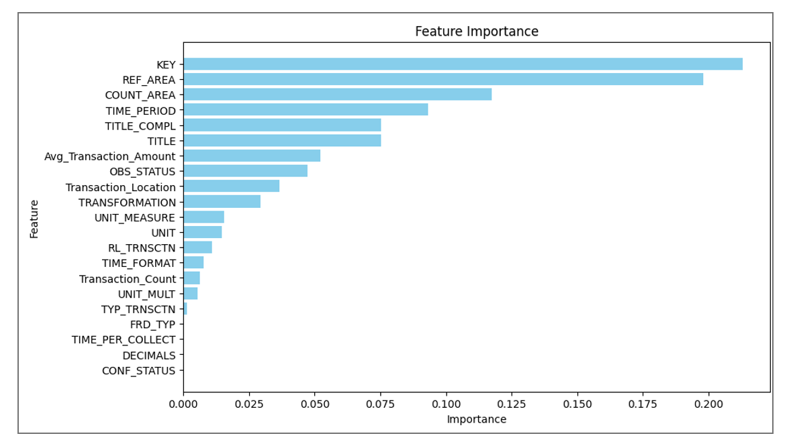
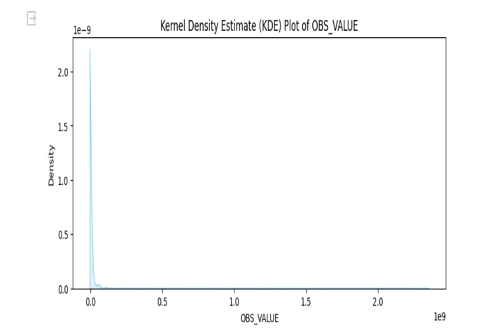
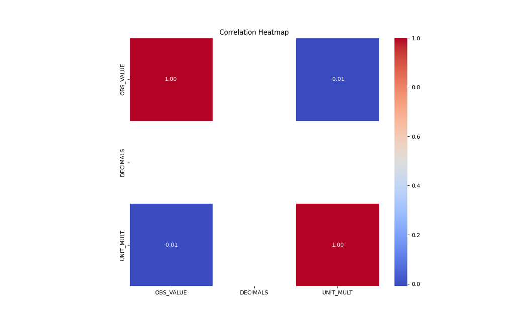
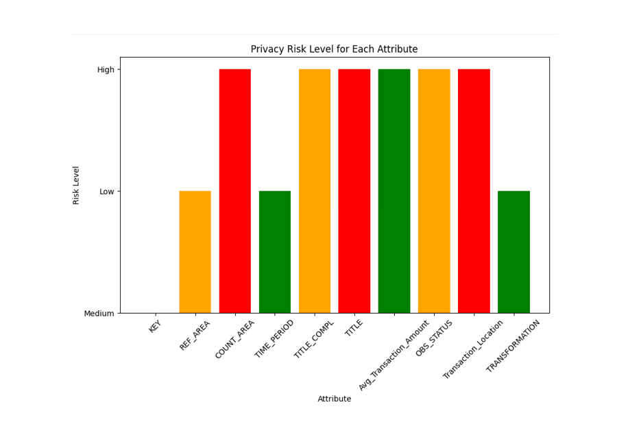

#  Data Privacy-Preserving Analysis for European Central Bank Transactions  
**Risk Stratification, Feature Importance & Predictive Modeling | Kent State Final Project**


---

##  Overview

This project tackles the challenge of analyzing **sensitive payment transaction data** from the European Central Bank (ECB) while preserving individual privacy. We implemented data preprocessing, anonymization, **risk stratification**, and built predictive models to quantify and visualize privacy risk — balancing utility with GDPR-compliant privacy protections.

---

##  Project Goal

> **How can we extract insights from ECB payment data while protecting personal transaction privacy and complying with regulations like GDPR?**

---

##  Techniques Used

| Area                        | Methodology                                                                 |
|-----------------------------|------------------------------------------------------------------------------|
| Data Preprocessing          | Null handling, outlier removal (Z-score), column sanitization               |
| Feature Engineering         | Interaction terms like `Transaction_Location`, `Transaction_Count`         |
| Modeling                    | Linear Regression, Random Forest Regressor                                  |
| Privacy Risk Analysis       | Feature Importance (Privacy Sensitivity), Risk Stratification               |
| Risk Aggregation            | Weighted privacy score per transaction                                       |
| Visualizations              | KDE plots, correlation heatmaps, scatterplots, risk bar charts              |
| Tools                       | Python (Pandas, Sklearn, Seaborn), Google Colab                             |

---

##  Sample Insights

-  **High-risk features**: `OBS_STATUS`, `Avg_Transaction_Amount`, `TITLE`, `COUNT_AREA`  
-  **Low-risk features**: `REF_AREA`, `TIME_PERIOD`, `TRANSFORMATION`
-  **Random Forest** achieved best R² score of **0.92**, outperforming Linear Regression
- ⚖ Final privacy risk level was classified as **Moderate**, with stratified zones: Low / Medium / High

---

##  Real-World Relevance

This project reflects challenges faced by:

-  **Central Banks** – ensuring compliance under GDPR  
-  **FinTech firms** – building risk-aware models on sensitive data  
-  **ML Engineers** – deploying explainable AI with privacy controls

###  Applications:
- Privacy-preserving AI pipelines  
- Risk-aware predictive modeling  
- Financial compliance dashboards

---

##  Feature Importance (Privacy Sensitivity View)

| Feature               | Privacy Risk Score |
|----------------------|--------------------|
| OBS_STATUS           | 0.115              |
| Avg_Transaction_Amount | 0.102            |
| TITLE_COMPL          | 0.092              |
| COUNT_AREA           | 0.069              |
| REF_AREA             | -0.018             |

 *Visualizations*:
- Bar chart: Feature risk scores  
- KDE plot: Distribution of `OBS_VALUE`  
- Heatmap: Correlation matrix of features  

###  Visualizations

####  Feature Importance – Privacy Risk


####  KDE Plot – Transaction Distribution


####  Correlation Heatmap


####  Risk Stratification Levels


---

##  Team Contributions

| Member                  | Responsibilities                                                                   |
|-------------------------|--------------------------------------------------------------------------------------|
| **Mukthasree Vengoti**  | Modeling (Random Forest), Risk Stratification & Aggregation, Reporting Insights     |
| Keerthi Akhila Pasam    | Feature Importance Visualizations, KDE/Heatmap Charts, Presentation Design          |
| Subhasmita Maharana     | Data Preprocessing, Feature Engineering, Report Compilation                         |

---

##  Repository Structure
```bash
ECB-Privacy-ML/
├── Big_Data_Analytics_Project.ipynb # Full Colab notebook
├── Group_41-CS-63016-Final_Project_Report.docx
├── README.md

```
---

## 🔗 Access Project Deliverables

-  [Final Report (DOCX)](./Group_41-CS-63016-Final_Project_Report.docx)  
-  [View Notebook (Google Colab)](https://colab.research.google.com/drive/1h2iEsEdQxtP47ORpaLQ-Cslj5H3ikPSF?usp=sharing)  
-  [Presentation Video](https://video.kent.edu/media/Project_Presentation_Group41/1_1nt4fn5r)  
-  [Demo Walkthrough](https://video.kent.edu/media/Project_demo+12A14A11+pm/1_gjdrk97i)

---

##  Keywords  
`Privacy-Preserving ML` `GDPR Compliance` `Risk Stratification` `Random Forest` `Feature Sensitivity` `ECB Data` `Big Data Privacy` `Python` `Explainable AI`

---

##  Citation

This project was submitted as part of the **Big Data Analytics course (CS-63016)** at **Kent State University (Spring 2024)** under Professor Xian Liang.

---


